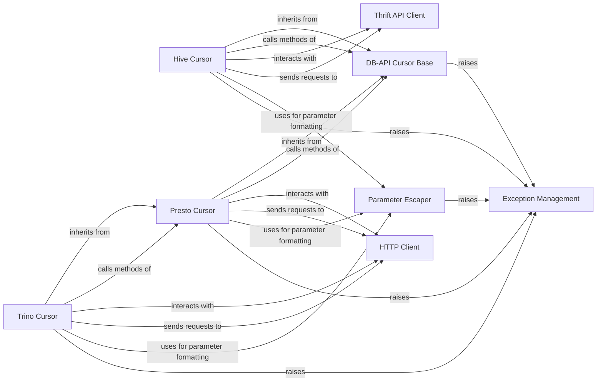

## Component Details

This system provides a set of DB-API compliant database cursors for various data sources like Hive, Presto, and Trino. It establishes a common base for cursor functionalities, handles SQL parameter escaping, manages interactions with specific database APIs (Thrift for Hive, HTTP for Presto/Trino), and incorporates a centralized exception management system to ensure robust database operations.

### DB-API Cursor Base
This component provides the fundamental interface and common logic for all database cursors in PyHive, adhering to the Python DB-API specification. It manages the cursor's internal state, handles generic fetching mechanisms like `fetchone` and `executemany`, and defines abstract methods that concrete cursor implementations must provide.

**Related Classes/Methods**:

- <a href="https://github.com/dropbox/PyHive/blob/master/pyhive/common.py#L27-L192" target="_blank" rel="noopener noreferrer">`pyhive.common.DBAPICursor` (27:192)</a>
- <a href="https://github.com/dropbox/PyHive/blob/master/pyhive/common.py#L34-L37" target="_blank" rel="noopener noreferrer">`pyhive.common.DBAPICursor:__init__` (34:37)</a>
- <a href="https://github.com/dropbox/PyHive/blob/master/pyhive/common.py#L49-L53" target="_blank" rel="noopener noreferrer">`pyhive.common.DBAPICursor:_fetch_while` (49:53)</a>
- <a href="https://github.com/dropbox/PyHive/blob/master/pyhive/common.py#L85-L98" target="_blank" rel="noopener noreferrer">`pyhive.common.DBAPICursor:executemany` (85:98)</a>
- <a href="https://github.com/dropbox/PyHive/blob/master/pyhive/common.py#L100-L117" target="_blank" rel="noopener noreferrer">`pyhive.common.DBAPICursor:fetchone` (100:117)</a>
- <a href="https://github.com/dropbox/PyHive/blob/master/pyhive/common.py#L177-L186" target="_blank" rel="noopener noreferrer">`pyhive.common.DBAPICursor:__next__` (177:186)</a>
- <a href="https://github.com/dropbox/PyHive/blob/master/pyhive/common.py#L39-L47" target="_blank" rel="noopener noreferrer">`pyhive.common.DBAPICursor._reset_state` (39:47)</a>
- <a href="https://github.com/dropbox/PyHive/blob/master/pyhive/common.py#L64-L66" target="_blank" rel="noopener noreferrer">`pyhive.common.DBAPICursor._fetch_more` (64:66)</a>

### Hive Cursor
This component implements the DB-API cursor specifically for HiveServer2. It handles the execution of SQL queries, manages the Thrift operation handle, and retrieves results by interacting with the HiveServer2 Thrift API.

**Related Classes/Methods**:

- <a href="https://github.com/dropbox/PyHive/blob/master/pyhive/hive.py#L361-L570" target="_blank" rel="noopener noreferrer">`pyhive.hive.Cursor` (361:570)</a>
- <a href="https://github.com/dropbox/PyHive/blob/master/pyhive/hive.py#L369-L373" target="_blank" rel="noopener noreferrer">`pyhive.hive.Cursor:__init__` (369:373)</a>
- <a href="https://github.com/dropbox/PyHive/blob/master/pyhive/hive.py#L375-L385" target="_blank" rel="noopener noreferrer">`pyhive.hive.Cursor:_reset_state` (375:385)</a>
- <a href="https://github.com/dropbox/PyHive/blob/master/pyhive/hive.py#L453-L482" target="_blank" rel="noopener noreferrer">`pyhive.hive.Cursor:execute` (453:482)</a>
- <a href="https://github.com/dropbox/PyHive/blob/master/pyhive/hive.py#L607-L611" target="_blank" rel="noopener noreferrer">`pyhive.hive._check_status` (607:611)</a>

### Presto Cursor
This component implements the DB-API cursor for Presto. It manages HTTP-based query execution, sends requests to the Presto REST API, and processes the JSON responses to retrieve query results and metadata.

**Related Classes/Methods**:

- <a href="https://github.com/dropbox/PyHive/blob/master/pyhive/presto.py#L91-L355" target="_blank" rel="noopener noreferrer">`pyhive.presto.Cursor` (91:355)</a>
- <a href="https://github.com/dropbox/PyHive/blob/master/pyhive/presto.py#L99-L206" target="_blank" rel="noopener noreferrer">`pyhive.presto.Cursor:__init__` (99:206)</a>
- <a href="https://github.com/dropbox/PyHive/blob/master/pyhive/presto.py#L208-L212" target="_blank" rel="noopener noreferrer">`pyhive.presto.Cursor:_reset_state` (208:212)</a>
- <a href="https://github.com/dropbox/PyHive/blob/master/pyhive/presto.py#L215-L242" target="_blank" rel="noopener noreferrer">`pyhive.presto.Cursor:description` (215:242)</a>
- <a href="https://github.com/dropbox/PyHive/blob/master/pyhive/presto.py#L244-L278" target="_blank" rel="noopener noreferrer">`pyhive.presto.Cursor:execute` (244:278)</a>
- <a href="https://github.com/dropbox/PyHive/blob/master/pyhive/presto.py#L325-L355" target="_blank" rel="noopener noreferrer">`pyhive.presto.Cursor:_process_response` (325:355)</a>

### Trino Cursor
This component extends the Presto cursor to provide specific functionalities for Trino. It primarily customizes the HTTP headers and response processing to align with Trino's API, while leveraging the core logic from the Presto cursor.

**Related Classes/Methods**:

- <a href="https://github.com/dropbox/PyHive/blob/master/pyhive/trino.py#L58-L132" target="_blank" rel="noopener noreferrer">`pyhive.trino.Cursor` (58:132)</a>
- <a href="https://github.com/dropbox/PyHive/blob/master/pyhive/trino.py#L66-L100" target="_blank" rel="noopener noreferrer">`pyhive.trino.Cursor:execute` (66:100)</a>
- <a href="https://github.com/dropbox/PyHive/blob/master/pyhive/trino.py#L102-L132" target="_blank" rel="noopener noreferrer">`pyhive.trino.Cursor:_process_response` (102:132)</a>

### Parameter Escaper
This component is responsible for safely formatting and escaping parameters for SQL queries. It provides methods to handle various data types such as numbers, strings, sequences, and datetime objects, with specialized implementations for Hive, Presto, and Trino to ensure correct syntax and prevent SQL injection.

**Related Classes/Methods**:

- <a href="https://github.com/dropbox/PyHive/blob/master/pyhive/common.py#L209-L260" target="_blank" rel="noopener noreferrer">`pyhive.common.ParamEscaper` (209:260)</a>
- <a href="https://github.com/dropbox/PyHive/blob/master/pyhive/common.py#L214-L220" target="_blank" rel="noopener noreferrer">`pyhive.common.ParamEscaper:escape_args` (214:220)</a>
- <a href="https://github.com/dropbox/PyHive/blob/master/pyhive/common.py#L246-L260" target="_blank" rel="noopener noreferrer">`pyhive.common.ParamEscaper:escape_item` (246:260)</a>
- <a href="https://github.com/dropbox/PyHive/blob/master/pyhive/common.py#L222-L223" target="_blank" rel="noopener noreferrer">`pyhive.common.ParamEscaper:escape_number` (222:223)</a>
- <a href="https://github.com/dropbox/PyHive/blob/master/pyhive/common.py#L225-L235" target="_blank" rel="noopener noreferrer">`pyhive.common.ParamEscaper:escape_string` (225:235)</a>
- <a href="https://github.com/dropbox/PyHive/blob/master/pyhive/common.py#L237-L239" target="_blank" rel="noopener noreferrer">`pyhive.common.ParamEscaper:escape_sequence` (237:239)</a>
- <a href="https://github.com/dropbox/PyHive/blob/master/pyhive/common.py#L241-L244" target="_blank" rel="noopener noreferrer">`pyhive.common.ParamEscaper:escape_datetime` (241:244)</a>
- <a href="https://github.com/dropbox/PyHive/blob/master/pyhive/presto.py#L45-L49" target="_blank" rel="noopener noreferrer">`pyhive.presto.PrestoParamEscaper` (45:49)</a>
- <a href="https://github.com/dropbox/PyHive/blob/master/pyhive/presto.py#L46-L49" target="_blank" rel="noopener noreferrer">`pyhive.presto.PrestoParamEscaper:escape_datetime` (46:49)</a>
- <a href="https://github.com/dropbox/PyHive/blob/master/pyhive/trino.py#L33-L34" target="_blank" rel="noopener noreferrer">`pyhive.trino.TrinoParamEscaper` (33:34)</a>
- <a href="https://github.com/dropbox/PyHive/blob/master/pyhive/hive.py#L114-L131" target="_blank" rel="noopener noreferrer">`pyhive.hive.HiveParamEscaper` (114:131)</a>

### Thrift API Client
This component encapsulates the interactions with the HiveServer2 Thrift API. It is responsible for constructing and sending Thrift requests (e.g., for closing operations or executing statements) and processing the Thrift responses, ensuring proper communication with the Hive server.

**Related Classes/Methods**:

- `TCLIService.ttypes.TCloseOperationReq` (full file reference)
- `TCLIService.ttypes.TExecuteStatementReq` (full file reference)

### HTTP Client
This component handles the underlying HTTP communication for Presto and Trino. It is responsible for sending HTTP requests (e.g., POST for query execution, GET for polling, DELETE for cancellation) and processing the HTTP responses, including status codes and JSON payloads.

**Related Classes/Methods**: _None_

### Exception Management
This component defines and manages various database-related exceptions, such as ProgrammingError, OperationalError, DatabaseError, and NotSupportedError. It is responsible for raising appropriate exceptions based on error conditions encountered during database operations.

**Related Classes/Methods**:

- <a href="https://github.com/dropbox/PyHive/blob/master/pyhive/exc.py#L53-L57" target="_blank" rel="noopener noreferrer">`pyhive.exc.ProgrammingError` (53:57)</a>
- <a href="https://github.com/dropbox/PyHive/blob/master/pyhive/exc.py#L44-L50" target="_blank" rel="noopener noreferrer">`pyhive.exc.OperationalError` (44:50)</a>
- <a href="https://github.com/dropbox/PyHive/blob/master/pyhive/exc.py#L33-L35" target="_blank" rel="noopener noreferrer">`pyhive.exc.DatabaseError` (33:35)</a>
- <a href="https://github.com/dropbox/PyHive/blob/master/pyhive/exc.py#L67-L72" target="_blank" rel="noopener noreferrer">`pyhive.exc.NotSupportedError` (67:72)</a>

### [FAQ](https://github.com/CodeBoarding/GeneratedOnBoardings/tree/main?tab=readme-ov-file#faq)