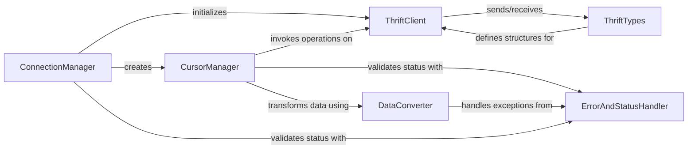

## Component Details

This graph illustrates the core components of the Hive DBAPI Connector, focusing on how connections are managed, queries are executed, and data is handled. The main flow involves establishing a connection via the ConnectionManager, which then provides CursorManager instances for query execution. All low-level communication with HiveServer2 is handled by the ThriftClient, which relies on ThriftTypes for data structuring. Error handling and data conversion are centralized in ErrorAndStatusHandler and DataConverter, respectively, ensuring robust and compliant interactions with the Hive database.

### ConnectionManager
Manages the lifecycle of a connection to HiveServer2, including opening, closing, and setting up authentication. It serves as the primary entry point for users to establish a connection and obtain cursor objects.

**Related Classes/Methods**:

- <a href="https://github.com/dropbox/PyHive/blob/master/pyhive/hive.py#L137-L143" target="_blank" rel="noopener noreferrer">`pyhive.hive.connect` (137:143)</a>
- <a href="https://github.com/dropbox/PyHive/blob/master/pyhive/hive.py#L146-L358" target="_blank" rel="noopener noreferrer">`pyhive.hive.Connection` (146:358)</a>
- <a href="https://github.com/dropbox/PyHive/blob/master/pyhive/hive.py#L149-L285" target="_blank" rel="noopener noreferrer">`pyhive.hive.Connection.__init__` (149:285)</a>
- <a href="https://github.com/dropbox/PyHive/blob/master/pyhive/hive.py#L334-L339" target="_blank" rel="noopener noreferrer">`pyhive.hive.Connection.close` (334:339)</a>
- <a href="https://github.com/dropbox/PyHive/blob/master/pyhive/hive.py#L288-L303" target="_blank" rel="noopener noreferrer">`pyhive.hive.Connection._set_authorization_header` (288:303)</a>
- <a href="https://github.com/dropbox/PyHive/blob/master/pyhive/hive.py#L306-L324" target="_blank" rel="noopener noreferrer">`pyhive.hive.Connection._set_kerberos_header` (306:324)</a>
- <a href="https://github.com/dropbox/PyHive/blob/master/pyhive/sasl_compat.py#L10-L15" target="_blank" rel="noopener noreferrer">`pyhive.sasl_compat.get_installed_sasl` (10:15)</a>
- <a href="https://github.com/dropbox/PyHive/blob/master/pyhive/sasl_compat.py#L18-L23" target="_blank" rel="noopener noreferrer">`pyhive.sasl_compat.get_sasl_client` (18:23)</a>
- <a href="https://github.com/dropbox/PyHive/blob/master/pyhive/sasl_compat.py#L26-L31" target="_blank" rel="noopener noreferrer">`pyhive.sasl_compat.get_pure_sasl_client` (26:31)</a>

### CursorManager
Responsible for executing SQL queries, managing the operation handle, fetching results, handling query-related operations like cancellation, polling for status, and retrieving logs. It implements the DB-API cursor interface.

**Related Classes/Methods**:

- <a href="https://github.com/dropbox/PyHive/blob/master/pyhive/hive.py#L361-L570" target="_blank" rel="noopener noreferrer">`pyhive.hive.Cursor` (361:570)</a>
- <a href="https://github.com/dropbox/PyHive/blob/master/pyhive/hive.py#L369-L373" target="_blank" rel="noopener noreferrer">`pyhive.hive.Cursor.__init__` (369:373)</a>
- <a href="https://github.com/dropbox/PyHive/blob/master/pyhive/hive.py#L453-L482" target="_blank" rel="noopener noreferrer">`pyhive.hive.Cursor.execute` (453:482)</a>
- <a href="https://github.com/dropbox/PyHive/blob/master/pyhive/hive.py#L491-L514" target="_blank" rel="noopener noreferrer">`pyhive.hive.Cursor._fetch_more` (491:514)</a>
- <a href="https://github.com/dropbox/PyHive/blob/master/pyhive/hive.py#L516-L533" target="_blank" rel="noopener noreferrer">`pyhive.hive.Cursor.poll` (516:533)</a>
- <a href="https://github.com/dropbox/PyHive/blob/master/pyhive/hive.py#L535-L570" target="_blank" rel="noopener noreferrer">`pyhive.hive.Cursor.fetch_logs` (535:570)</a>
- <a href="https://github.com/dropbox/PyHive/blob/master/pyhive/hive.py#L484-L489" target="_blank" rel="noopener noreferrer">`pyhive.hive.Cursor.cancel` (484:489)</a>
- <a href="https://github.com/dropbox/PyHive/blob/master/pyhive/hive.py#L449-L451" target="_blank" rel="noopener noreferrer">`pyhive.hive.Cursor.close` (449:451)</a>
- <a href="https://github.com/dropbox/PyHive/blob/master/pyhive/hive.py#L375-L385" target="_blank" rel="noopener noreferrer">`pyhive.hive.Cursor._reset_state` (375:385)</a>
- <a href="https://github.com/dropbox/PyHive/blob/master/pyhive/hive.py#L401-L441" target="_blank" rel="noopener noreferrer">`pyhive.hive.Cursor.description` (401:441)</a>

### ThriftClient
Provides the low-level interface for communicating with the HiveServer2 Thrift API. It encapsulates the methods for sending various Thrift requests and receiving their corresponding responses.

**Related Classes/Methods**:

- <a href="https://github.com/dropbox/PyHive/blob/master/TCLIService/TCLIService.py#L174-L861" target="_blank" rel="noopener noreferrer">`TCLIService.TCLIService.Client` (174:861)</a>
- <a href="https://github.com/dropbox/PyHive/blob/master/TCLIService/TCLIService.py#L181-L187" target="_blank" rel="noopener noreferrer">`TCLIService.TCLIService.Client.OpenSession` (181:187)</a>
- <a href="https://github.com/dropbox/PyHive/blob/master/TCLIService/TCLIService.py#L212-L218" target="_blank" rel="noopener noreferrer">`TCLIService.TCLIService.Client.CloseSession` (212:218)</a>
- <a href="https://github.com/dropbox/PyHive/blob/master/TCLIService/TCLIService.py#L274-L280" target="_blank" rel="noopener noreferrer">`TCLIService.TCLIService.Client.ExecuteStatement` (274:280)</a>
- <a href="https://github.com/dropbox/PyHive/blob/master/TCLIService/TCLIService.py#L584-L590" target="_blank" rel="noopener noreferrer">`TCLIService.TCLIService.Client.GetOperationStatus` (584:590)</a>
- <a href="https://github.com/dropbox/PyHive/blob/master/TCLIService/TCLIService.py#L615-L621" target="_blank" rel="noopener noreferrer">`TCLIService.TCLIService.Client.CancelOperation` (615:621)</a>
- <a href="https://github.com/dropbox/PyHive/blob/master/TCLIService/TCLIService.py#L646-L652" target="_blank" rel="noopener noreferrer">`TCLIService.TCLIService.Client.CloseOperation` (646:652)</a>
- <a href="https://github.com/dropbox/PyHive/blob/master/TCLIService/TCLIService.py#L677-L683" target="_blank" rel="noopener noreferrer">`TCLIService.TCLIService.Client.GetResultSetMetadata` (677:683)</a>
- <a href="https://github.com/dropbox/PyHive/blob/master/TCLIService/TCLIService.py#L708-L714" target="_blank" rel="noopener noreferrer">`TCLIService.TCLIService.Client.FetchResults` (708:714)</a>
- <a href="https://github.com/dropbox/PyHive/blob/master/TCLIService/TCLIService.py#L832-L838" target="_blank" rel="noopener noreferrer">`TCLIService.TCLIService.Client.GetLog` (832:838)</a>

### ThriftTypes
Defines all the Thrift data structures, including request and response objects, session and operation handles, and status codes, which are fundamental for structured communication between the client and HiveServer2.

**Related Classes/Methods**:

- `TCLIService.ttypes` (full file reference)
- `TCLIService.ttypes.TOpenSessionReq` (full file reference)
- `TCLIService.ttypes.TCloseSessionReq` (full file reference)
- `TCLIService.ttypes.TExecuteStatementReq` (full file reference)
- `TCLIService.ttypes.TGetOperationStatusReq` (full file reference)
- `TCLIService.ttypes.TCancelOperationReq` (full file reference)
- `TCLIService.ttypes.TCloseOperationReq` (full file reference)
- `TCLIService.ttypes.TGetResultSetMetadataReq` (full file reference)
- `TCLIService.ttypes.TFetchResultsReq` (full file reference)
- `TCLIService.ttypes.TGetLogReq` (full file reference)
- `TCLIService.ttypes.TOpenSessionResp` (full file reference)
- `TCLIService.ttypes.TCloseSessionResp` (full file reference)
- `TCLIService.ttypes.TExecuteStatementResp` (full file reference)
- `TCLIService.ttypes.TGetOperationStatusResp` (full file reference)
- `TCLIService.ttypes.TCancelOperationResp` (full file reference)
- `TCLIService.ttypes.TCloseOperationResp` (full file reference)
- `TCLIService.ttypes.TGetResultSetMetadataResp` (full file reference)
- `TCLIService.ttypes.TFetchResultsResp` (full file reference)
- `TCLIService.ttypes.TGetLogResp` (full file reference)
- `TCLIService.ttypes.TStatus` (full file reference)
- `TCLIService.ttypes.TSessionHandle` (full file reference)
- `TCLIService.ttypes.TOperationHandle` (full file reference)

### ErrorAndStatusHandler
Provides a centralized mechanism for validating the status of Thrift responses received from HiveServer2 and raising appropriate Python DB-API exceptions (e.g., OperationalError, ProgrammingError, DataError) based on the Thrift status codes.

**Related Classes/Methods**:

- <a href="https://github.com/dropbox/PyHive/blob/master/pyhive/hive.py#L607-L611" target="_blank" rel="noopener noreferrer">`pyhive.hive._check_status` (607:611)</a>
- <a href="https://github.com/dropbox/PyHive/blob/master/pyhive/exc.py#L44-L50" target="_blank" rel="noopener noreferrer">`pyhive.exc.OperationalError` (44:50)</a>
- <a href="https://github.com/dropbox/PyHive/blob/master/pyhive/exc.py#L53-L57" target="_blank" rel="noopener noreferrer">`pyhive.exc.ProgrammingError` (53:57)</a>
- <a href="https://github.com/dropbox/PyHive/blob/master/pyhive/exc.py#L60-L64" target="_blank" rel="noopener noreferrer">`pyhive.exc.DataError` (60:64)</a>

### DataConverter
Handles the conversion of data types between Hive's Thrift representation and Python's native types, ensuring data integrity and usability. It also manages the escaping of parameters for SQL queries to prevent injection issues.

**Related Classes/Methods**:

- <a href="https://github.com/dropbox/PyHive/blob/master/pyhive/hive.py#L588-L604" target="_blank" rel="noopener noreferrer">`pyhive.hive._unwrap_column` (588:604)</a>
- <a href="https://github.com/dropbox/PyHive/blob/master/pyhive/hive.py#L91-L107" target="_blank" rel="noopener noreferrer">`pyhive.hive._parse_timestamp` (91:107)</a>
- <a href="https://github.com/dropbox/PyHive/blob/master/pyhive/hive.py#L114-L131" target="_blank" rel="noopener noreferrer">`pyhive.hive.HiveParamEscaper` (114:131)</a>
- <a href="https://github.com/dropbox/PyHive/blob/master/pyhive/common.py#L214-L220" target="_blank" rel="noopener noreferrer">`pyhive.common.ParamEscaper.escape_args` (214:220)</a>

### [FAQ](https://github.com/CodeBoarding/GeneratedOnBoardings/tree/main?tab=readme-ov-file#faq)