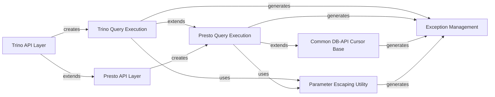

## Component Details

The Presto/Trino DBAPI Connector provides DBAPI-compliant interfaces for connecting to and executing queries against Presto and Trino databases. It manages connection lifecycle, cursor operations, and response processing, with the Trino connector extending the functionalities of the Presto connector to ensure compatibility and specialized handling for each database.

### Trino API Layer
This component provides the high-level interface for establishing connections to a Trino database and obtaining cursor objects. It acts as an entry point for Trino-specific database interactions, inheriting core connection functionalities from the Presto API layer.

**Related Classes/Methods**:

- <a href="https://github.com/dropbox/PyHive/blob/master/pyhive/trino.py#L40-L46" target="_blank" rel="noopener noreferrer">`pyhive.trino.connect` (40:46)</a>
- <a href="https://github.com/dropbox/PyHive/blob/master/pyhive/trino.py#L49-L55" target="_blank" rel="noopener noreferrer">`pyhive.trino.Connection` (49:55)</a>
- <a href="https://github.com/dropbox/PyHive/blob/master/pyhive/trino.py#L50-L51" target="_blank" rel="noopener noreferrer">`pyhive.trino.Connection:__init__` (50:51)</a>
- <a href="https://github.com/dropbox/PyHive/blob/master/pyhive/trino.py#L53-L55" target="_blank" rel="noopener noreferrer">`pyhive.trino.Connection:cursor` (53:55)</a>

### Trino Query Execution
Responsible for executing SQL queries against a Trino database and managing the lifecycle of query results. It handles parameter escaping, state management, and processing of responses received from the Trino server, including error handling.

**Related Classes/Methods**:

- <a href="https://github.com/dropbox/PyHive/blob/master/pyhive/trino.py#L58-L132" target="_blank" rel="noopener noreferrer">`pyhive.trino.Cursor` (58:132)</a>
- <a href="https://github.com/dropbox/PyHive/blob/master/pyhive/trino.py#L66-L100" target="_blank" rel="noopener noreferrer">`pyhive.trino.Cursor:execute` (66:100)</a>
- <a href="https://github.com/dropbox/PyHive/blob/master/pyhive/trino.py#L102-L132" target="_blank" rel="noopener noreferrer">`pyhive.trino.Cursor:_process_response` (102:132)</a>

### Presto API Layer
This component offers the foundational interface for connecting to a Presto database and creating cursor objects. It defines the basic connection and cursor creation mechanisms, serving as a base for Trino-specific implementations.

**Related Classes/Methods**:

- <a href="https://github.com/dropbox/PyHive/blob/master/pyhive/presto.py#L55-L61" target="_blank" rel="noopener noreferrer">`pyhive.presto.connect` (55:61)</a>
- <a href="https://github.com/dropbox/PyHive/blob/master/pyhive/presto.py#L64-L88" target="_blank" rel="noopener noreferrer">`pyhive.presto.Connection` (64:88)</a>
- <a href="https://github.com/dropbox/PyHive/blob/master/pyhive/presto.py#L83-L85" target="_blank" rel="noopener noreferrer">`pyhive.presto.Connection:cursor` (83:85)</a>
- <a href="https://github.com/dropbox/PyHive/blob/master/pyhive/presto.py#L87-L88" target="_blank" rel="noopener noreferrer">`pyhive.presto.Connection:rollback` (87:88)</a>

### Presto Query Execution
Manages the execution of queries for Presto, including handling query parameters, resetting cursor state, fetching and processing data from the database, and managing query cancellation. It extends the common DB-API cursor functionality.

**Related Classes/Methods**:

- <a href="https://github.com/dropbox/PyHive/blob/master/pyhive/presto.py#L91-L355" target="_blank" rel="noopener noreferrer">`pyhive.presto.Cursor` (91:355)</a>
- <a href="https://github.com/dropbox/PyHive/blob/master/pyhive/presto.py#L99-L206" target="_blank" rel="noopener noreferrer">`pyhive.presto.Cursor:__init__` (99:206)</a>
- <a href="https://github.com/dropbox/PyHive/blob/master/pyhive/presto.py#L208-L212" target="_blank" rel="noopener noreferrer">`pyhive.presto.Cursor:_reset_state` (208:212)</a>
- <a href="https://github.com/dropbox/PyHive/blob/master/pyhive/presto.py#L215-L242" target="_blank" rel="noopener noreferrer">`pyhive.presto.Cursor:description` (215:242)</a>
- <a href="https://github.com/dropbox/PyHive/blob/master/pyhive/presto.py#L244-L278" target="_blank" rel="noopener noreferrer">`pyhive.presto.Cursor:execute` (244:278)</a>
- <a href="https://github.com/dropbox/PyHive/blob/master/pyhive/presto.py#L280-L293" target="_blank" rel="noopener noreferrer">`pyhive.presto.Cursor:cancel` (280:293)</a>
- <a href="https://github.com/dropbox/PyHive/blob/master/pyhive/presto.py#L295-L311" target="_blank" rel="noopener noreferrer">`pyhive.presto.Cursor:poll` (295:311)</a>
- <a href="https://github.com/dropbox/PyHive/blob/master/pyhive/presto.py#L313-L315" target="_blank" rel="noopener noreferrer">`pyhive.presto.Cursor:_fetch_more` (313:315)</a>
- <a href="https://github.com/dropbox/PyHive/blob/master/pyhive/presto.py#L325-L355" target="_blank" rel="noopener noreferrer">`pyhive.presto.Cursor:_process_response` (325:355)</a>

### Common DB-API Cursor Base
Provides a generic, abstract implementation of the DB-API cursor specification. It defines common behaviors for database cursors, such as state management, fetching multiple rows, and iteration, which are then specialized by database-specific cursors.

**Related Classes/Methods**:

- <a href="https://github.com/dropbox/PyHive/blob/master/pyhive/common.py#L27-L192" target="_blank" rel="noopener noreferrer">`pyhive.common.DBAPICursor` (27:192)</a>
- <a href="https://github.com/dropbox/PyHive/blob/master/pyhive/common.py#L34-L37" target="_blank" rel="noopener noreferrer">`pyhive.common.DBAPICursor:__init__` (34:37)</a>
- <a href="https://github.com/dropbox/PyHive/blob/master/pyhive/common.py#L39-L47" target="_blank" rel="noopener noreferrer">`pyhive.common.DBAPICursor:_reset_state` (39:47)</a>
- <a href="https://github.com/dropbox/PyHive/blob/master/pyhive/common.py#L49-L53" target="_blank" rel="noopener noreferrer">`pyhive.common.DBAPICursor:_fetch_while` (49:53)</a>
- <a href="https://github.com/dropbox/PyHive/blob/master/pyhive/common.py#L85-L98" target="_blank" rel="noopener noreferrer">`pyhive.common.DBAPICursor:executemany` (85:98)</a>
- <a href="https://github.com/dropbox/PyHive/blob/master/pyhive/common.py#L100-L117" target="_blank" rel="noopener noreferrer">`pyhive.common.DBAPICursor:fetchone` (100:117)</a>
- <a href="https://github.com/dropbox/PyHive/blob/master/pyhive/common.py#L177-L186" target="_blank" rel="noopener noreferrer">`pyhive.common.DBAPICursor:__next__` (177:186)</a>
- <a href="https://github.com/dropbox/PyHive/blob/master/pyhive/common.py#L64-L66" target="_blank" rel="noopener noreferrer">`pyhive.common.DBAPICursor._fetch_more` (64:66)</a>

### Parameter Escaping Utility
This utility component is responsible for safely formatting and escaping various data types (numbers, strings, dates, sequences) to be used as parameters in SQL queries, preventing issues like SQL injection. It provides a base for database-specific escaping rules.

**Related Classes/Methods**:

- <a href="https://github.com/dropbox/PyHive/blob/master/pyhive/common.py#L209-L260" target="_blank" rel="noopener noreferrer">`pyhive.common.ParamEscaper` (209:260)</a>
- <a href="https://github.com/dropbox/PyHive/blob/master/pyhive/common.py#L214-L220" target="_blank" rel="noopener noreferrer">`pyhive.common.ParamEscaper:escape_args` (214:220)</a>
- <a href="https://github.com/dropbox/PyHive/blob/master/pyhive/common.py#L246-L260" target="_blank" rel="noopener noreferrer">`pyhive.common.ParamEscaper:escape_item` (246:260)</a>
- <a href="https://github.com/dropbox/PyHive/blob/master/pyhive/common.py#L222-L223" target="_blank" rel="noopener noreferrer">`pyhive.common.ParamEscaper:escape_number` (222:223)</a>
- <a href="https://github.com/dropbox/PyHive/blob/master/pyhive/common.py#L225-L235" target="_blank" rel="noopener noreferrer">`pyhive.common.ParamEscaper:escape_string` (225:235)</a>
- <a href="https://github.com/dropbox/PyHive/blob/master/pyhive/common.py#L237-L239" target="_blank" rel="noopener noreferrer">`pyhive.common.ParamEscaper:escape_sequence` (237:239)</a>
- <a href="https://github.com/dropbox/PyHive/blob/master/pyhive/common.py#L241-L244" target="_blank" rel="noopener noreferrer">`pyhive.common.ParamEscaper:escape_datetime` (241:244)</a>
- <a href="https://github.com/dropbox/PyHive/blob/master/pyhive/presto.py#L46-L49" target="_blank" rel="noopener noreferrer">`pyhive.presto.PrestoParamEscaper:escape_datetime` (46:49)</a>
- <a href="https://github.com/dropbox/PyHive/blob/master/pyhive/trino.py#L33-L34" target="_blank" rel="noopener noreferrer">`pyhive.trino.TrinoParamEscaper` (33:34)</a>

### Exception Management
Defines a comprehensive set of custom exception classes that adhere to the DB-API specification. These exceptions are raised to signal various types of errors encountered during database operations, providing structured error handling.

**Related Classes/Methods**:

- <a href="https://github.com/dropbox/PyHive/blob/master/pyhive/exc.py#L13-L18" target="_blank" rel="noopener noreferrer">`pyhive.exc.Error` (13:18)</a>
- <a href="https://github.com/dropbox/PyHive/blob/master/pyhive/exc.py#L21-L23" target="_blank" rel="noopener noreferrer">`pyhive.exc.Warning` (21:23)</a>
- <a href="https://github.com/dropbox/PyHive/blob/master/pyhive/exc.py#L26-L30" target="_blank" rel="noopener noreferrer">`pyhive.exc.InterfaceError` (26:30)</a>
- <a href="https://github.com/dropbox/PyHive/blob/master/pyhive/exc.py#L33-L35" target="_blank" rel="noopener noreferrer">`pyhive.exc.DatabaseError` (33:35)</a>
- <a href="https://github.com/dropbox/PyHive/blob/master/pyhive/exc.py#L38-L41" target="_blank" rel="noopener noreferrer">`pyhive.exc.InternalError` (38:41)</a>
- <a href="https://github.com/dropbox/PyHive/blob/master/pyhive/exc.py#L44-L50" target="_blank" rel="noopener noreferrer">`pyhive.exc.OperationalError` (44:50)</a>
- <a href="https://github.com/dropbox/PyHive/blob/master/pyhive/exc.py#L53-L57" target="_blank" rel="noopener noreferrer">`pyhive.exc.ProgrammingError` (53:57)</a>
- <a href="https://github.com/dropbox/PyHive/blob/master/pyhive/exc.py#L60-L64" target="_blank" rel="noopener noreferrer">`pyhive.exc.DataError` (60:64)</a>
- <a href="https://github.com/dropbox/PyHive/blob/master/pyhive/exc.py#L67-L72" target="_blank" rel="noopener noreferrer">`pyhive.exc.NotSupportedError` (67:72)</a>

### [FAQ](https://github.com/CodeBoarding/GeneratedOnBoardings/tree/main?tab=readme-ov-file#faq)