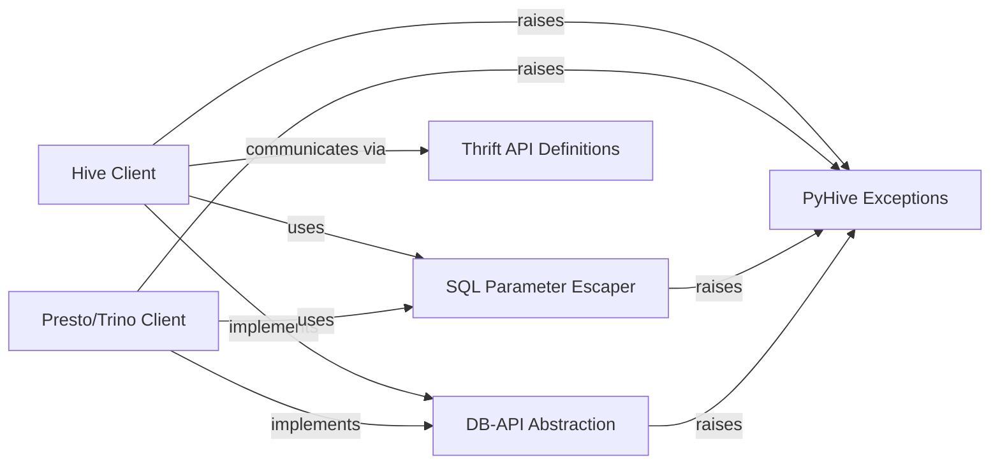

## Component Details

This graph illustrates the core components of the PyHive library, focusing on how different database clients (Hive, Presto/Trino) interact with common abstractions like the DB-API and SQL parameter escaping, and how a unified exception handling mechanism is utilized across the system. The main flow involves clients establishing connections, executing queries, and handling potential errors through a defined exception hierarchy.

### Hive Client
This component provides the core functionality for connecting to and interacting with HiveServer2. It manages the Thrift-based connection, handles session management, and facilitates query execution, result fetching, and log retrieval specific to Hive.

**Related Classes/Methods**:

- <a href="https://github.com/dropbox/PyHive/blob/master/pyhive/hive.py#L146-L358" target="_blank" rel="noopener noreferrer">`PyHive.pyhive.hive.Connection` (146:358)</a>
- <a href="https://github.com/dropbox/PyHive/blob/master/pyhive/hive.py#L357-L358" target="_blank" rel="noopener noreferrer">`PyHive.pyhive.hive.Connection:rollback` (357:358)</a>
- <a href="https://github.com/dropbox/PyHive/blob/master/pyhive/hive.py#L361-L570" target="_blank" rel="noopener noreferrer">`PyHive.pyhive.hive.Cursor` (361:570)</a>
- <a href="https://github.com/dropbox/PyHive/blob/master/pyhive/hive.py#L491-L514" target="_blank" rel="noopener noreferrer">`PyHive.pyhive.hive.Cursor:_fetch_more` (491:514)</a>
- <a href="https://github.com/dropbox/PyHive/blob/master/pyhive/hive.py#L516-L533" target="_blank" rel="noopener noreferrer">`PyHive.pyhive.hive.Cursor:poll` (516:533)</a>
- <a href="https://github.com/dropbox/PyHive/blob/master/pyhive/hive.py#L535-L570" target="_blank" rel="noopener noreferrer">`PyHive.pyhive.hive.Cursor:fetch_logs` (535:570)</a>
- <a href="https://github.com/dropbox/PyHive/blob/master/pyhive/hive.py#L607-L611" target="_blank" rel="noopener noreferrer">`PyHive.pyhive.hive._check_status` (607:611)</a>
- <a href="https://github.com/dropbox/PyHive/blob/master/pyhive/hive.py#L588-L604" target="_blank" rel="noopener noreferrer">`PyHive.pyhive.hive._unwrap_column` (588:604)</a>

### Presto/Trino Client
This component is responsible for establishing connections and executing queries against Presto and Trino databases. It extends the common DB-API cursor functionality to handle the specific HTTP REST API interactions and data processing for these platforms.

**Related Classes/Methods**:

- <a href="https://github.com/dropbox/PyHive/blob/master/pyhive/presto.py#L64-L88" target="_blank" rel="noopener noreferrer">`PyHive.pyhive.presto.Connection` (64:88)</a>
- <a href="https://github.com/dropbox/PyHive/blob/master/pyhive/presto.py#L87-L88" target="_blank" rel="noopener noreferrer">`PyHive.pyhive.presto.Connection:rollback` (87:88)</a>
- <a href="https://github.com/dropbox/PyHive/blob/master/pyhive/presto.py#L91-L355" target="_blank" rel="noopener noreferrer">`PyHive.pyhive.presto.Cursor` (91:355)</a>
- <a href="https://github.com/dropbox/PyHive/blob/master/pyhive/presto.py#L280-L293" target="_blank" rel="noopener noreferrer">`PyHive.pyhive.presto.Cursor:cancel` (280:293)</a>
- <a href="https://github.com/dropbox/PyHive/blob/master/pyhive/presto.py#L295-L311" target="_blank" rel="noopener noreferrer">`PyHive.pyhive.presto.Cursor:poll` (295:311)</a>
- <a href="https://github.com/dropbox/PyHive/blob/master/pyhive/presto.py#L325-L355" target="_blank" rel="noopener noreferrer">`PyHive.pyhive.presto.Cursor:_process_response` (325:355)</a>
- <a href="https://github.com/dropbox/PyHive/blob/master/pyhive/presto.py#L317-L323" target="_blank" rel="noopener noreferrer">`PyHive.pyhive.presto.Cursor:_process_data` (317:323)</a>
- <a href="https://github.com/dropbox/PyHive/blob/master/pyhive/trino.py#L58-L132" target="_blank" rel="noopener noreferrer">`PyHive.pyhive.trino.Cursor` (58:132)</a>
- <a href="https://github.com/dropbox/PyHive/blob/master/pyhive/trino.py#L102-L132" target="_blank" rel="noopener noreferrer">`PyHive.pyhive.trino.Cursor:_process_response` (102:132)</a>

### DB-API Abstraction
This component defines the abstract base classes and common utilities that adhere to the Python DB-API 2.0 specification. It provides a standardized interface for database cursors, including methods for fetching rows and managing cursor state, which are then implemented by specific database clients.

**Related Classes/Methods**:

- <a href="https://github.com/dropbox/PyHive/blob/master/pyhive/common.py#L27-L192" target="_blank" rel="noopener noreferrer">`PyHive.pyhive.common.DBAPICursor` (27:192)</a>
- <a href="https://github.com/dropbox/PyHive/blob/master/pyhive/common.py#L100-L117" target="_blank" rel="noopener noreferrer">`PyHive.pyhive.common.DBAPICursor:fetchone` (100:117)</a>
- <a href="https://github.com/dropbox/PyHive/blob/master/pyhive/common.py#L49-L53" target="_blank" rel="noopener noreferrer">`PyHive.pyhive.common.DBAPICursor:_fetch_while` (49:53)</a>

### SQL Parameter Escaper
This component handles the crucial task of safely formatting and escaping various Python data types (numbers, strings, dates, sequences) into SQL-compatible strings. This prevents SQL injection vulnerabilities and ensures correct query syntax.

**Related Classes/Methods**:

- <a href="https://github.com/dropbox/PyHive/blob/master/pyhive/common.py#L209-L260" target="_blank" rel="noopener noreferrer">`PyHive.pyhive.common.ParamEscaper` (209:260)</a>
- <a href="https://github.com/dropbox/PyHive/blob/master/pyhive/common.py#L214-L220" target="_blank" rel="noopener noreferrer">`PyHive.pyhive.common.ParamEscaper:escape_args` (214:220)</a>
- <a href="https://github.com/dropbox/PyHive/blob/master/pyhive/common.py#L246-L260" target="_blank" rel="noopener noreferrer">`PyHive.pyhive.common.ParamEscaper:escape_item` (246:260)</a>

### Thrift API Definitions
This component encompasses the generated Thrift data types and service definitions used for communication with HiveServer2. It provides the structured messages and protocols necessary for the Hive client to interact with the Hive Thrift service.

**Related Classes/Methods**:

- `TCLIService.ttypes` (full file reference)

### PyHive Exceptions
This component defines a set of custom exception classes that are raised to indicate various database-related errors, such as unsupported operations, programming errors, operational issues, or data errors. These exceptions provide a structured way to handle errors within the PyHive library.

**Related Classes/Methods**:

- <a href="https://github.com/dropbox/PyHive/blob/master/pyhive/exc.py#L13-L18" target="_blank" rel="noopener noreferrer">`pyhive.exc.Error` (13:18)</a>
- <a href="https://github.com/dropbox/PyHive/blob/master/pyhive/exc.py#L26-L30" target="_blank" rel="noopener noreferrer">`pyhive.exc.InterfaceError` (26:30)</a>
- <a href="https://github.com/dropbox/PyHive/blob/master/pyhive/exc.py#L33-L35" target="_blank" rel="noopener noreferrer">`pyhive.exc.DatabaseError` (33:35)</a>
- <a href="https://github.com/dropbox/PyHive/blob/master/pyhive/exc.py#L38-L41" target="_blank" rel="noopener noreferrer">`pyhive.exc.InternalError` (38:41)</a>
- <a href="https://github.com/dropbox/PyHive/blob/master/pyhive/exc.py#L44-L50" target="_blank" rel="noopener noreferrer">`pyhive.exc.OperationalError` (44:50)</a>
- <a href="https://github.com/dropbox/PyHive/blob/master/pyhive/exc.py#L53-L57" target="_blank" rel="noopener noreferrer">`pyhive.exc.ProgrammingError` (53:57)</a>
- <a href="https://github.com/dropbox/PyHive/blob/master/pyhive/exc.py#L60-L64" target="_blank" rel="noopener noreferrer">`pyhive.exc.DataError` (60:64)</a>
- <a href="https://github.com/dropbox/PyHive/blob/master/pyhive/exc.py#L67-L72" target="_blank" rel="noopener noreferrer">`pyhive.exc.NotSupportedError` (67:72)</a>

### [FAQ](https://github.com/CodeBoarding/GeneratedOnBoardings/tree/main?tab=readme-ov-file#faq)