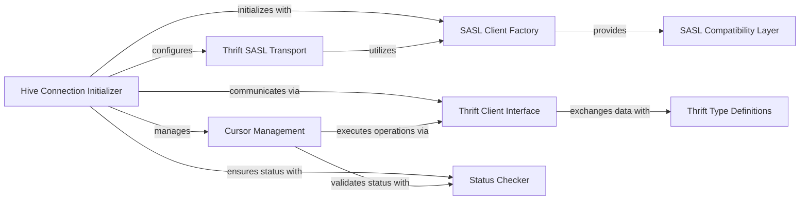

## Component Details

The SASL Authentication Layer in PyHive provides a robust client-side implementation for various SASL mechanisms, primarily to secure connections with HiveServer2. It achieves this by offering a flexible compatibility layer that can utilize either the 'python-sasl' or 'pure-sasl' libraries, managed by a dedicated SASL Client Factory. This factory dynamically selects the appropriate SASL client, which is then integrated into the Thrift transport by the Hive Connection Initializer. This secure transport facilitates authenticated communication with the HiveServer2's Thrift Client Interface, ensuring that all data exchanges adhere to the defined Thrift Type Definitions and are validated for success by the Status Checker. The entire process enables secure and reliable database interactions, including cursor management for query execution.

### SASL Compatibility Layer
Provides a compatibility layer for SASL authentication within PyHive, allowing it to seamlessly integrate with either the 'python-sasl' or 'pure-sasl' libraries. It includes the `PureSASLClient` class, which wraps the 'pure-sasl' client's functionalities, and an `error_catcher` context manager for robust handling of SASL-related exceptions during authentication processes.

**Related Classes/Methods**:

- <a href="https://github.com/dropbox/PyHive/blob/master/pyhive/sasl_compat.py#L22-L56" target="_blank" rel="noopener noreferrer">`pyhive.sasl_compat.PureSASLClient` (22:56)</a>
- <a href="https://github.com/dropbox/PyHive/blob/master/pyhive/sasl_compat.py#L27-L35" target="_blank" rel="noopener noreferrer">`pyhive.sasl_compat.PureSASLClient:start` (27:35)</a>
- <a href="https://github.com/dropbox/PyHive/blob/master/pyhive/sasl_compat.py#L37-L41" target="_blank" rel="noopener noreferrer">`pyhive.sasl_compat.PureSASLClient:encode` (37:41)</a>
- <a href="https://github.com/dropbox/PyHive/blob/master/pyhive/sasl_compat.py#L43-L47" target="_blank" rel="noopener noreferrer">`pyhive.sasl_compat.PureSASLClient:decode` (43:47)</a>
- <a href="https://github.com/dropbox/PyHive/blob/master/pyhive/sasl_compat.py#L49-L53" target="_blank" rel="noopener noreferrer">`pyhive.sasl_compat.PureSASLClient:step` (49:53)</a>
- <a href="https://github.com/dropbox/PyHive/blob/master/pyhive/sasl_compat.py#L14-L19" target="_blank" rel="noopener noreferrer">`pyhive.sasl_compat.error_catcher` (14:19)</a>

### SASL Client Factory
Responsible for dynamically providing the appropriate SASL client instance based on available libraries. It prioritizes the 'sasl' library (python-sasl) and gracefully falls back to using the 'pure-sasl' library, facilitated by the 'SASL Compatibility Layer', if the preferred 'sasl' library is not installed.

**Related Classes/Methods**:

- <a href="https://github.com/dropbox/PyHive/blob/master/pyhive/hive.py#L52-L66" target="_blank" rel="noopener noreferrer">`pyhive.hive.get_sasl_client` (52:66)</a>
- <a href="https://github.com/dropbox/PyHive/blob/master/pyhive/hive.py#L69-L79" target="_blank" rel="noopener noreferrer">`pyhive.hive.get_pure_sasl_client` (69:79)</a>
- <a href="https://github.com/dropbox/PyHive/blob/master/pyhive/hive.py#L82-L88" target="_blank" rel="noopener noreferrer">`pyhive.hive.get_installed_sasl` (82:88)</a>

### Hive Connection Initializer
Manages the establishment and configuration of connections to HiveServer2. This component is critical for setting up the Thrift transport, handling various authentication mechanisms (including SASL via the `SASL Client Factory`), and initializing the Thrift client for subsequent communication.

**Related Classes/Methods**:

- <a href="https://github.com/dropbox/PyHive/blob/master/pyhive/hive.py#L149-L285" target="_blank" rel="noopener noreferrer">`pyhive.hive.Connection:__init__` (149:285)</a>
- <a href="https://github.com/dropbox/PyHive/blob/master/pyhive/hive.py#L288-L303" target="_blank" rel="noopener noreferrer">`pyhive.hive.Connection._set_authorization_header` (288:303)</a>
- <a href="https://github.com/dropbox/PyHive/blob/master/pyhive/hive.py#L306-L324" target="_blank" rel="noopener noreferrer">`pyhive.hive.Connection._set_kerberos_header` (306:324)</a>

### Thrift SASL Transport
An external Thrift transport layer (`thrift_sasl.TSaslClientTransport`) that integrates with a SASL client to provide secure communication over Thrift. It wraps a standard Thrift socket transport and handles the SASL negotiation process.

**Related Classes/Methods**:

- `thrift_sasl.TSaslClientTransport` (full file reference)
- <a href="https://github.com/dropbox/PyHive/blob/master/pyhive/hive.py#L149-L285" target="_blank" rel="noopener noreferrer">`pyhive.hive.Connection:__init__` (149:285)</a>

### Thrift Client Interface
Represents the primary interface for interacting with the HiveServer2's TCLIService. It utilizes the underlying Thrift transport (which can be SASL-enabled) to send requests and receive responses for operations like opening sessions, executing statements, and managing query operations.

**Related Classes/Methods**:

- <a href="https://github.com/dropbox/PyHive/blob/master/TCLIService/TCLIService.py#L174-L861" target="_blank" rel="noopener noreferrer">`TCLIService.TCLIService.Client` (174:861)</a>
- <a href="https://github.com/dropbox/PyHive/blob/master/TCLIService/TCLIService.py#L181-L187" target="_blank" rel="noopener noreferrer">`TCLIService.TCLIService.Client.OpenSession` (181:187)</a>

### Thrift Type Definitions
Defines the structured data types (e.g., requests, responses, and their fields) used for communication within the Thrift protocol, ensuring proper serialization and deserialization of data exchanged between the PyHive client and HiveServer2.

**Related Classes/Methods**:

- `TCLIService.ttypes.TOpenSessionReq` (full file reference)
- `TCLIService.ttypes.TStatusCode` (full file reference)

### Status Checker
A utility component responsible for validating the success status of responses received from HiveServer2 via the Thrift API. It raises an `OperationalError` if a response indicates a failure, ensuring that errors are propagated appropriately within the PyHive application.

**Related Classes/Methods**:

- <a href="https://github.com/dropbox/PyHive/blob/master/pyhive/hive.py#L607-L611" target="_blank" rel="noopener noreferrer">`pyhive.hive._check_status` (607:611)</a>

### Cursor Management
Handles the creation, lifecycle, and operations of database cursors, which are essential for managing the context of data fetching and query execution within PyHive. It provides methods for executing SQL, fetching results, and closing operations.

**Related Classes/Methods**:

- <a href="https://github.com/dropbox/PyHive/blob/master/pyhive/hive.py#L345-L347" target="_blank" rel="noopener noreferrer">`pyhive.hive.Connection.cursor` (345:347)</a>
- <a href="https://github.com/dropbox/PyHive/blob/master/pyhive/hive.py#L361-L570" target="_blank" rel="noopener noreferrer">`pyhive.hive.Cursor` (361:570)</a>

### [FAQ](https://github.com/CodeBoarding/GeneratedOnBoardings/tree/main?tab=readme-ov-file#faq)