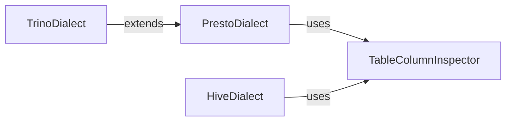

## Component Details

This subsystem provides SQLAlchemy dialect implementations for Hive, Presto, and Trino databases. It enables Object Relational Mapping (ORM) functionalities and schema introspection for these databases. The core flow involves establishing connections, introspecting database schemas (tables, columns, indexes, views), and compiling SQL statements specific to each database. The Trino dialect extends the Presto dialect, inheriting and adapting its functionalities.

### PrestoDialect
The PrestoDialect component provides the core integration between SQLAlchemy and Presto. It handles connection arguments, schema and table introspection, and type mapping for Presto-specific data types. It also manages how SQL statements are compiled for Presto.

**Related Classes/Methods**:

- <a href="https://github.com/dropbox/PyHive/blob/master/pyhive/sqlalchemy_presto.py#L79-L223" target="_blank" rel="noopener noreferrer">`pyhive.sqlalchemy_presto.PrestoDialect` (79:223)</a>
- <a href="https://github.com/dropbox/PyHive/blob/master/pyhive/sqlalchemy_presto.py#L151-L156" target="_blank" rel="noopener noreferrer">`pyhive.sqlalchemy_presto.PrestoDialect.has_table` (151:156)</a>
- <a href="https://github.com/dropbox/PyHive/blob/master/pyhive/sqlalchemy_presto.py#L158-L174" target="_blank" rel="noopener noreferrer">`pyhive.sqlalchemy_presto.PrestoDialect.get_columns` (158:174)</a>
- <a href="https://github.com/dropbox/PyHive/blob/master/pyhive/sqlalchemy_presto.py#L184-L205" target="_blank" rel="noopener noreferrer">`pyhive.sqlalchemy_presto.PrestoDialect.get_indexes` (184:205)</a>
- <a href="https://github.com/dropbox/PyHive/blob/master/pyhive/sqlalchemy_presto.py#L127-L149" target="_blank" rel="noopener noreferrer">`pyhive.sqlalchemy_presto.PrestoDialect._get_table_columns` (127:149)</a>
- <a href="https://github.com/dropbox/PyHive/blob/master/pyhive/sqlalchemy_presto.py#L54-L56" target="_blank" rel="noopener noreferrer">`pyhive.sqlalchemy_presto.PrestoCompiler` (54:56)</a>
- <a href="https://github.com/dropbox/PyHive/blob/master/pyhive/sqlalchemy_presto.py#L34-L36" target="_blank" rel="noopener noreferrer">`pyhive.sqlalchemy_presto.PrestoIdentifierPreparer` (34:36)</a>
- <a href="https://github.com/dropbox/PyHive/blob/master/pyhive/sqlalchemy_presto.py#L59-L76" target="_blank" rel="noopener noreferrer">`pyhive.sqlalchemy_presto.PrestoTypeCompiler` (59:76)</a>

### HiveDialect
The HiveDialect component provides the core integration between SQLAlchemy and Hive. It handles schema and table introspection, and manages how SQL statements are compiled for Hive. It also includes specific handling for view names.

**Related Classes/Methods**:

- <a href="https://github.com/dropbox/PyHive/blob/master/pyhive/sqlalchemy_hive.py#L241-L392" target="_blank" rel="noopener noreferrer">`pyhive.sqlalchemy_hive.HiveDialect` (241:392)</a>
- <a href="https://github.com/dropbox/PyHive/blob/master/pyhive/sqlalchemy_hive.py#L286-L289" target="_blank" rel="noopener noreferrer">`pyhive.sqlalchemy_hive.HiveDialect.get_view_names` (286:289)</a>
- <a href="https://github.com/dropbox/PyHive/blob/master/pyhive/sqlalchemy_hive.py#L315-L320" target="_blank" rel="noopener noreferrer">`pyhive.sqlalchemy_hive.HiveDialect.has_table` (315:320)</a>
- <a href="https://github.com/dropbox/PyHive/blob/master/pyhive/sqlalchemy_hive.py#L322-L348" target="_blank" rel="noopener noreferrer">`pyhive.sqlalchemy_hive.HiveDialect.get_columns` (322:348)</a>
- <a href="https://github.com/dropbox/PyHive/blob/master/pyhive/sqlalchemy_hive.py#L358-L374" target="_blank" rel="noopener noreferrer">`pyhive.sqlalchemy_hive.HiveDialect.get_indexes` (358:374)</a>
- <a href="https://github.com/dropbox/PyHive/blob/master/pyhive/sqlalchemy_hive.py#L291-L313" target="_blank" rel="noopener noreferrer">`pyhive.sqlalchemy_hive.HiveDialect._get_table_columns` (291:313)</a>
- <a href="https://github.com/dropbox/PyHive/blob/master/pyhive/sqlalchemy_hive.py#L376-L380" target="_blank" rel="noopener noreferrer">`pyhive.sqlalchemy_hive.HiveDialect.get_table_names` (376:380)</a>
- <a href="https://github.com/dropbox/PyHive/blob/master/pyhive/sqlalchemy_hive.py#L155-L180" target="_blank" rel="noopener noreferrer">`pyhive.sqlalchemy_hive.HiveCompiler` (155:180)</a>
- <a href="https://github.com/dropbox/PyHive/blob/master/pyhive/sqlalchemy_hive.py#L218-L238" target="_blank" rel="noopener noreferrer">`pyhive.sqlalchemy_hive.HiveExecutionContext` (218:238)</a>
- <a href="https://github.com/dropbox/PyHive/blob/master/pyhive/sqlalchemy_hive.py#L122-L130" target="_blank" rel="noopener noreferrer">`pyhive.sqlalchemy_hive.HiveIdentifierPreparer` (122:130)</a>
- <a href="https://github.com/dropbox/PyHive/blob/master/pyhive/sqlalchemy_hive.py#L183-L215" target="_blank" rel="noopener noreferrer">`pyhive.sqlalchemy_hive.HiveTypeCompiler` (183:215)</a>

### TrinoDialect
The TrinoDialect component extends the PrestoDialect, inheriting its core functionalities and providing specific adaptations for Trino databases. It leverages the existing Presto implementation for connection handling, introspection, and SQL compilation, with minor overrides for Trino-specific behaviors.

**Related Classes/Methods**:

- <a href="https://github.com/dropbox/PyHive/blob/master/pyhive/sqlalchemy_trino.py#L74-L84" target="_blank" rel="noopener noreferrer">`pyhive.sqlalchemy_trino.TrinoDialect` (74:84)</a>
- <a href="https://github.com/dropbox/PyHive/blob/master/pyhive/sqlalchemy_trino.py#L50-L51" target="_blank" rel="noopener noreferrer">`pyhive.sqlalchemy_trino.TrinoCompiler` (50:51)</a>
- <a href="https://github.com/dropbox/PyHive/blob/master/pyhive/sqlalchemy_trino.py#L31-L32" target="_blank" rel="noopener noreferrer">`pyhive.sqlalchemy_trino.TrinoIdentifierPreparer` (31:32)</a>
- <a href="https://github.com/dropbox/PyHive/blob/master/pyhive/sqlalchemy_trino.py#L54-L71" target="_blank" rel="noopener noreferrer">`pyhive.sqlalchemy_trino.TrinoTypeCompiler` (54:71)</a>

### TableColumnInspector
The TableColumnInspector component is responsible for retrieving column information for a given table. It is a shared utility used by both PrestoDialect and HiveDialect to determine table existence, column details, and index information.

**Related Classes/Methods**:

- <a href="https://github.com/dropbox/PyHive/blob/master/pyhive/sqlalchemy_presto.py#L127-L149" target="_blank" rel="noopener noreferrer">`pyhive.sqlalchemy_presto.PrestoDialect._get_table_columns` (127:149)</a>
- <a href="https://github.com/dropbox/PyHive/blob/master/pyhive/sqlalchemy_hive.py#L291-L313" target="_blank" rel="noopener noreferrer">`pyhive.sqlalchemy_hive.HiveDialect._get_table_columns` (291:313)</a>

### [FAQ](https://github.com/CodeBoarding/GeneratedOnBoardings/tree/main?tab=readme-ov-file#faq)