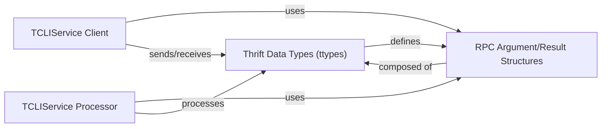

## Component Details

The TCLIService Thrift Layer in PyHive represents the auto-generated Thrift code for the HiveServer2 (TCLIService) API. It provides the foundational structures and interfaces for client-server communication. This layer includes the definitions for all data types exchanged (requests, responses, handles, schemas, row sets), the client-side interface for initiating RPC calls, and the server-side processor logic for handling incoming requests. Its purpose is to enable seamless serialization and deserialization of data, allowing Python applications to interact with HiveServer2 using the Thrift protocol.

### Thrift Data Types (ttypes)
This component encompasses all the auto-generated Thrift data structures and enums defined in `pyhive.TCLIService.ttypes`. These types are fundamental for serializing and deserializing data exchanged between the client and the HiveServer2. They define the format for requests, responses, session handles, operation handles, table schemas, row sets, and individual column values.

**Related Classes/Methods**:

- `pyhive.TCLIService.ttypes.TOpenSessionReq` (full file reference)
- `pyhive.TCLIService.ttypes.TCloseSessionReq` (full file reference)
- `pyhive.TCLIService.ttypes.TExecuteStatementReq` (full file reference)
- `pyhive.TCLIService.ttypes.TFetchResultsReq` (full file reference)
- `pyhive.TCLIService.ttypes.TGetResultSetMetadataReq` (full file reference)
- `pyhive.TCLIService.ttypes.TTableSchema` (full file reference)
- `pyhive.TCLIService.ttypes.TRowSet` (full file reference)

### TCLIService Client
The TCLIService Client component provides the client-side interface for interacting with the HiveServer2. It encapsulates the logic for sending various Thrift RPC requests (e.g., OpenSession, ExecuteStatement, FetchResults) and receiving their corresponding responses. This component is responsible for initiating communication and managing the client's interaction flow with the server.

**Related Classes/Methods**:

- `pyhive.TCLIService.TCLIService.Client` (174:861)
- `pyhive.TCLIService.TCLIService.Client:OpenSession` (full file reference)
- `pyhive.TCLIService.TCLIService.Client:ExecuteStatement` (full file reference)
- `pyhive.TCLIService.TCLIService.Client:FetchResults` (full file reference)
- `pyhive.TCLIService.TCLIService.Client:CloseSession` (full file reference)

### TCLIService Processor
The TCLIService Processor component acts as the server-side handler for incoming Thrift RPC calls. It is responsible for receiving requests, deserializing them, invoking the appropriate service methods, and serializing the results back to the client. This component effectively bridges the Thrift communication layer with the actual HiveServer2 logic.

**Related Classes/Methods**:

- `pyhive.TCLIService.TCLIService.Processor` (full file reference)
- `pyhive.TCLIService.TCLIService.Processor:process_OpenSession` (full file reference)
- `pyhive.TCLIService.TCLIService.Processor:process_ExecuteStatement` (full file reference)
- `pyhive.TCLIService.TCLIService.Processor:process_FetchResults` (full file reference)
- `pyhive.TCLIService.TCLIService.Processor:process_CloseSession` (full file reference)

### RPC Argument/Result Structures
This component represents the auto-generated Thrift classes that define the arguments and results for each specific RPC method in the TCLIService. These classes (e.g., OpenSession_args, OpenSession_result) are crucial for the serialization and deserialization of data during RPC calls, ensuring that the client and server can correctly interpret the parameters and return values of each operation.

**Related Classes/Methods**:

- `pyhive.TCLIService.TCLIService.OpenSession_args` (full file reference)
- `pyhive.TCLIService.TCLIService.OpenSession_result` (full file reference)
- `pyhive.TCLIService.TCLIService.ExecuteStatement_args` (full file reference)
- `pyhive.TCLIService.TCLIService.ExecuteStatement_result` (full file reference)
- `pyhive.TCLIService.TCLIService.FetchResults_args` (full file reference)
- `pyhive.TCLIService.TCLIService.FetchResults_result` (full file reference)

### [FAQ](https://github.com/CodeBoarding/GeneratedOnBoardings/tree/main?tab=readme-ov-file#faq)