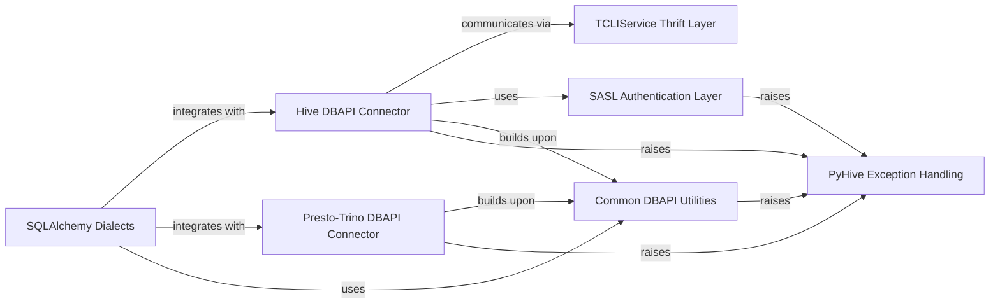

## Component Details

PyHive is a Python DBAPI and SQLAlchemy dialect implementation for Hive, Presto, and Trino. It provides a standardized interface for connecting to these distributed SQL engines, enabling users to execute queries and retrieve results. The architecture is modular, separating concerns such as database-specific connectivity, common DBAPI utilities, authentication mechanisms, Thrift communication, and SQLAlchemy dialect implementations, all while providing a consistent exception handling framework.

### Hive DBAPI Connector
Provides the core DBAPI-compliant interface for connecting to and interacting with Hive databases, managing sessions, cursors, and query execution via the Thrift service.

**Related Classes/Methods**:

- <a href="https://github.com/dropbox/PyHive/blob/master/pyhive/hive.py#L146-L358" target="_blank" rel="noopener noreferrer">`PyHive.pyhive.hive.Connection` (146:358)</a>
- <a href="https://github.com/dropbox/PyHive/blob/master/pyhive/hive.py#L361-L570" target="_blank" rel="noopener noreferrer">`PyHive.pyhive.hive.Cursor` (361:570)</a>
- <a href="https://github.com/dropbox/PyHive/blob/master/pyhive/hive.py#L137-L143" target="_blank" rel="noopener noreferrer">`PyHive.pyhive.hive.connect` (137:143)</a>
- <a href="https://github.com/dropbox/PyHive/blob/master/pyhive/hive.py#L607-L611" target="_blank" rel="noopener noreferrer">`PyHive.pyhive.hive._check_status` (607:611)</a>
- <a href="https://github.com/dropbox/PyHive/blob/master/pyhive/hive.py#L588-L604" target="_blank" rel="noopener noreferrer">`PyHive.pyhive.hive._unwrap_column` (588:604)</a>

### Presto-Trino DBAPI Connector
Offers DBAPI-compliant interfaces for connecting to and executing queries against Presto and Trino databases, handling connection management, cursor operations, and response processing. The Trino connector extends the Presto connector.

**Related Classes/Methods**:

- <a href="https://github.com/dropbox/PyHive/blob/master/pyhive/presto.py#L64-L88" target="_blank" rel="noopener noreferrer">`PyHive.pyhive.presto.Connection` (64:88)</a>
- <a href="https://github.com/dropbox/PyHive/blob/master/pyhive/presto.py#L91-L355" target="_blank" rel="noopener noreferrer">`PyHive.pyhive.presto.Cursor` (91:355)</a>
- <a href="https://github.com/dropbox/PyHive/blob/master/pyhive/presto.py#L55-L61" target="_blank" rel="noopener noreferrer">`PyHive.pyhive.presto.connect` (55:61)</a>
- <a href="https://github.com/dropbox/PyHive/blob/master/pyhive/trino.py#L49-L55" target="_blank" rel="noopener noreferrer">`PyHive.pyhive.trino.Connection` (49:55)</a>
- <a href="https://github.com/dropbox/PyHive/blob/master/pyhive/trino.py#L58-L132" target="_blank" rel="noopener noreferrer">`PyHive.pyhive.trino.Cursor` (58:132)</a>
- <a href="https://github.com/dropbox/PyHive/blob/master/pyhive/trino.py#L40-L46" target="_blank" rel="noopener noreferrer">`PyHive.pyhive.trino.connect` (40:46)</a>

### Common DBAPI Utilities
Encapsulates shared functionalities for DBAPI compliance, including base cursor behaviors and SQL parameter escaping, used across different database connectors.

**Related Classes/Methods**:

- <a href="https://github.com/dropbox/PyHive/blob/master/pyhive/common.py#L27-L192" target="_blank" rel="noopener noreferrer">`PyHive.pyhive.common.DBAPICursor` (27:192)</a>
- <a href="https://github.com/dropbox/PyHive/blob/master/pyhive/common.py#L209-L260" target="_blank" rel="noopener noreferrer">`PyHive.pyhive.common.ParamEscaper` (209:260)</a>

### SASL Authentication Layer
Provides client-side implementation for SASL mechanisms, enabling secure authentication for connections, particularly with HiveServer2.

**Related Classes/Methods**:

- <a href="https://github.com/dropbox/PyHive/blob/master/pyhive/sasl_compat.py#L22-L56" target="_blank" rel="noopener noreferrer">`PyHive.pyhive.sasl_compat.PureSASLClient` (22:56)</a>

### TCLIService Thrift Layer
Represents the auto-generated Thrift code for the HiveServer2 (TCLIService) API, including client interface, data types for requests/responses, and server-side processor logic.

**Related Classes/Methods**:

- <a href="https://github.com/dropbox/PyHive/blob/master/TCLIService/TCLIService.py#L174-L861" target="_blank" rel="noopener noreferrer">`PyHive.TCLIService.TCLIService.Client` (174:861)</a>
- `PyHive.TCLIService.ttypes.TOpenSessionReq` (full file reference)
- `PyHive.TCLIService.ttypes.TCloseSessionReq` (full file reference)
- `PyHive.TCLIService.ttypes.TExecuteStatementReq` (full file reference)
- `PyHive.TCLIService.ttypes.TFetchResultsReq` (full file reference)
- `PyHive.TCLIService.ttypes.TGetResultSetMetadataReq` (full file reference)

### SQLAlchemy Dialects
Provides SQLAlchemy dialect implementations for Hive, Presto, and Trino databases, enabling ORM functionalities and schema introspection. The Trino dialect extends the Presto dialect.

**Related Classes/Methods**:

- <a href="https://github.com/dropbox/PyHive/blob/master/pyhive/sqlalchemy_hive.py#L241-L392" target="_blank" rel="noopener noreferrer">`PyHive.pyhive.sqlalchemy_hive.HiveDialect` (241:392)</a>
- <a href="https://github.com/dropbox/PyHive/blob/master/pyhive/sqlalchemy_presto.py#L79-L223" target="_blank" rel="noopener noreferrer">`PyHive.pyhive.sqlalchemy_presto.PrestoDialect` (79:223)</a>
- <a href="https://github.com/dropbox/PyHive/blob/master/pyhive/sqlalchemy_trino.py#L74-L84" target="_blank" rel="noopener noreferrer">`PyHive.pyhive.sqlalchemy_trino.TrinoDialect` (74:84)</a>

### PyHive Exception Handling
Defines a hierarchy of custom exception classes for various database-related errors within PyHive.

**Related Classes/Methods**:

- <a href="https://github.com/dropbox/PyHive/blob/master/pyhive/exc.py#L60-L64" target="_blank" rel="noopener noreferrer">`pyhive.exc.DataError` (60:64)</a>
- <a href="https://github.com/dropbox/PyHive/blob/master/pyhive/exc.py#L33-L35" target="_blank" rel="noopener noreferrer">`pyhive.exc.DatabaseError` (33:35)</a>
- <a href="https://github.com/dropbox/PyHive/blob/master/pyhive/exc.py#L26-L30" target="_blank" rel="noopener noreferrer">`pyhive.exc.InterfaceError` (26:30)</a>
- <a href="https://github.com/dropbox/PyHive/blob/master/pyhive/exc.py#L38-L41" target="_blank" rel="noopener noreferrer">`pyhive.exc.InternalError` (38:41)</a>
- <a href="https://github.com/dropbox/PyHive/blob/master/pyhive/exc.py#L67-L72" target="_blank" rel="noopener noreferrer">`pyhive.exc.NotSupportedError` (67:72)</a>
- <a href="https://github.com/dropbox/PyHive/blob/master/pyhive/exc.py#L44-L50" target="_blank" rel="noopener noreferrer">`pyhive.exc.OperationalError` (44:50)</a>
- <a href="https://github.com/dropbox/PyHive/blob/master/pyhive/exc.py#L53-L57" target="_blank" rel="noopener noreferrer">`pyhive.exc.ProgrammingError` (53:57)</a>
- <a href="https://github.com/dropbox/PyHive/blob/master/pyhive/exc.py#L13-L18" target="_blank" rel="noopener noreferrer">`pyhive.exc.Error` (13:18)</a>

### [FAQ](https://github.com/CodeBoarding/GeneratedOnBoardings/tree/main?tab=readme-ov-file#faq)